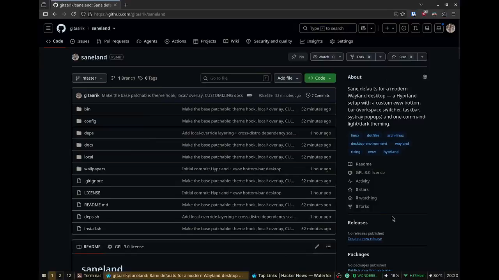

# saneland

*Sane defaults for a modern Wayland desktop — old-school simple window
management, new-school underneath.*

A complete **Hyprland desktop** built around a custom **eww bottom bar** —
workspace switcher, per-workspace taskbar, and a keyboard-navigable systray
(audio, network, bluetooth, battery, clock) with one-click popups — plus a
one-command **light/dark theme switcher** that repaints the whole session.

> Arch Linux + Wayland. Everything is plain config + shell scripts; no
> compiled components except the optional hyprbars plugin.


<!-- TODO: drop a real screenshot at docs/screenshot.png -->

---

## Features

- **eww bottom bar** replacing waybar — reactive, scriptable, themeable.
- **Per-workspace taskbar** driven by a small window-order daemon, so window
  order is stable (not reshuffled on focus).
- **Systray with popups** for audio, network (wifi list + connect), bluetooth
  (paired devices, connect/disconnect), battery (health, profile) and a
  clock/calendar — each opens on a single click and switches cleanly to
  another popup on the next click.
- **Start menu** popup with pinned apps + a rofi "all apps" fallback, and
  inline confirmation for power actions.
- **One-command theming** — `theme dark` / `theme light` flips the eww bar,
  swaync, GTK, rofi and the wallpaper together via a symlink-swap pattern.
- **Wallpaper rotation** with per-theme image pools (hyprpaper).
- **Quality-of-life Hyprland scripts** — MRU Alt-Tab, window snapping /
  centering / maximize-toggle, scroll-to-switch workspaces, brightness &
  battery helpers.

## Repository layout

```
config/          # → ~/.config/*  (whole-dir symlinks)
  eww/           # the bar: eww.yuck + _eww-common.scss + per-theme SCSS + scripts/
  hypr/          # hyprland.conf, hyprpaper.conf, hyprlock.conf, hypridle.conf
  swaync/        # notification daemon (theme-integrated)
  rofi/          # launcher — the start menu's "all apps" fallback (theme-integrated)
  gtk-3.0/ gtk-4.0/   # GTK app theming, so Firefox/dialogs follow light/dark
bin/             # → ~/.local/bin/*  (per-file symlinks): hypr-* helpers, theme, hyprsig …
wallpapers/      # drop your own images into dark/ and light/
docs/            # ARCHITECTURE.md — the non-obvious design notes & gotchas
install.sh       # symlinks everything into place (backs up what's there)
```

## Dependencies

Core (required):

`./deps.sh` maps this canonical list to your distro's package names and offers
to install them (`./deps.sh --print` to just see the plan). The list itself:

| Purpose            | Package(s) |
|--------------------|------------|
| Compositor         | `hyprland`, `uwsm`, `xdg-desktop-portal-hyprland` |
| Bar                | `eww` (0.5.x) |
| Notifications      | `swaync` |
| Launcher           | `rofi` (wayland fork) |
| Audio              | `wireplumber` (`wpctl`) + `pipewire-pulse` (`pactl`) |
| Network            | `networkmanager` (`nmcli`) |
| Bluetooth          | `bluez`, `bluez-utils` (`bluetoothctl`), `blueman` |
| Battery/power      | `upower`, `power-profiles-daemon` |
| GTK theme/icons    | `materia-gtk-theme`, `papirus-icon-theme` (the names `theme` sets via gsettings — swap in the script for others) |
| Misc CLI           | `jq`, `python`, `nmap` (`ncat`), `brightnessctl`, `rfkill`, `libnotify` |
| Wallpaper          | `hyprpaper` |
| Fonts              | `ttf-adwaita`/Adwaita Sans, `ttf-jetbrains-mono-nerd` |

Optional (referenced by `hyprland.conf` — each only affects its own
binding/autostart if missing):

- `hyprlock` + `hypridle` — lock screen & idle policy
- `hyprbars` — window title bars (compiled plugin, see below)
- `hyprsunset` — night-light color temperature (autostarted)
- `hyprshot` + `satty` — screenshot capture & annotation (Print-key binds)

### Distro support

The configs and scripts are distro-agnostic (they're just files in `~/.config`
and `~/.local/bin`) — only *dependency installation* differs per distro, and
that's isolated in `deps/`:

- **Arch** — first-class (repos + a few AUR packages).
- **Fedora** — supported via the `solopasha/hyprland` COPR (a few package names
  still want verifying — PRs welcome).
- **Debian/Ubuntu & others** — best-effort. The Hyprland stack is bleeding-edge
  and thinly packaged here, so expect to build `eww`/Hyprland from source;
  `deps.sh` installs what *is* packaged and lists the rest. Mind the minimum
  versions (`deps/manifest.sh`) — an older packaged Hyprland/eww can break the
  configs.

Adding a distro is just a new `deps/<distro>.sh` mapping the IDs in
`deps/manifest.sh` — no changes to the core.

## Install

```bash
git clone <your-fork-url> saneland
cd saneland
./deps.sh             # install dependencies for your distro (or --print)
./install.sh          # symlink configs + scripts (--dry-run to preview)
```

`install.sh` symlinks `config/*` into `~/.config/` and `bin/*` into
`~/.local/bin/`, backing up anything already there to `*.bak-<timestamp>`. It
also creates the default (dark) active-theme symlinks and seeds
`~/.config/hypr/local.conf` from the example (never clobbering an existing one).

Then:

1. **Alt-Tab MRU** needs raw keyboard access — add yourself to `input`:
   ```bash
   sudo usermod -aG input "$USER"   # then log out and back in
   ```
2. **hyprbars** (window title bars with close/maximize buttons) is a compiled
   plugin pinned to the Hyprland ABI — install once, rebuild after every
   Hyprland upgrade:
   ```bash
   hyprpm update
   hyprpm add https://github.com/hyprwm/hyprland-plugins
   hyprpm enable hyprbars
   ```
3. Drop wallpapers into `wallpapers/dark/` and `wallpapers/light/`.
4. Log into the **Hyprland (uwsm-managed)** session (the uwsm wrapper is what
   activates `graphical-session.target`, which the desktop portals gate on),
   or in a running session: `hyprctl reload && eww reload`.

## Theming

```bash
theme dark
theme light
```

Each app keeps `config-dark.<ext>` and `config-light.<ext>` files plus a
`config.<ext>` symlink pointing at the active one; `theme` swaps the symlinks
and nudges each daemon to reload. The active theme is also recorded in
`~/.cache/current-theme` for anything else you want to follow it.

GTK is the exception: dark links a settings/CSS override, light removes it to
fall back to the system light theme, and `gsettings` drives portal-aware apps
(Firefox, Thunderbird, file dialogs) via the Materia theme + Papirus icons.

## Personalize

Machine-specific settings live in **git-ignored local override files**, so the
tracked base config stays identical for everyone (and updates never clobber
your tweaks):

- **`~/.config/hypr/local.conf`** (seeded from `local.conf.example`) — your
  **monitors**, `$term`/`$browser`, and extra `exec-once` autostarts. It's
  `source`d after the base defaults, so your values win. This is the main
  place you'll edit.
- **`config/eww/_local.scss`** — override the bar's **accent color and fonts**
  (reassign `$accent`/`$accent-tint`, set `$font-family`/`$font-size`). Ships
  as a comment-only stub.

Everything else is opinionated-but-editable in the tracked files:

- **Keybinds & window rules** — the `bind`/`windowrule` blocks in
  `hyprland.conf`.
- **Start-menu pins** — the `start-item` rows in `config/eww/eww.yuck`.
- **Wallpaper rotation interval** — top of `bin/hypr-wallpaper-rotate`.
- **eww monitor** — bar windows use `:monitor 0` (first output); multi-monitor
  users edit `config/eww/eww.yuck` (not yet a `local` tunable).

## How it works / gotchas

The non-obvious bits — why popups grab (or don't grab) the keyboard, how the
MRU Alt-Tab reads `/dev/input`, the hyprpaper 0.8.4 IPC quirks, the stale
`HYPRLAND_INSTANCE_SIGNATURE` trap, and more — are documented in
[docs/ARCHITECTURE.md](docs/ARCHITECTURE.md).

## License

[GPL-3.0](LICENSE). Contributions welcome.
